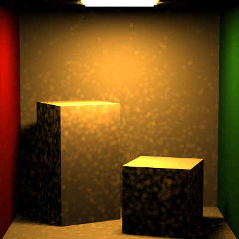
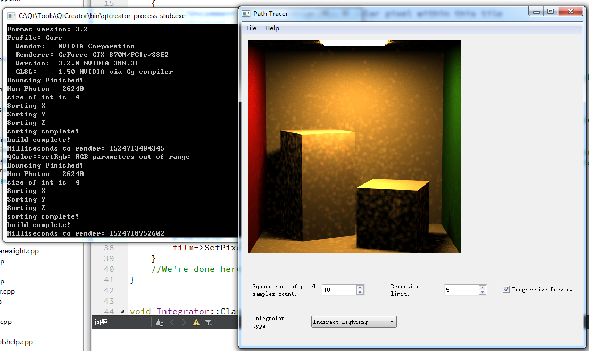
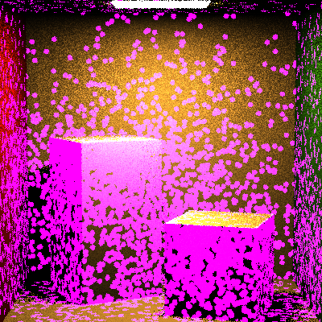

# HW9_PhotonMapping

## Results

100 samples, 5 recursions. 

26240 photons(exclude the first batch came out directly from light.)

It took almost 1.5 hour to render this image. 

## Important Notice: 

Due to UNKNOWN reasons, the GUI has some problems... it remains the old version even if I replaced the original mainwindow.ui

So, to use photon mapping, you should select "Indirect Lighting" since photon mapping does not exist in the menu(although I added it). 

For the performance part, the photon bounce part is very fast, problem lies in the sorting before building kd tree. 

If the total photons to sort is more than 50K, we shall have some problems. I wonder if that's the int's problem, but seems in Qt the sizeof int is 4 byte so there shouldn't be a problem.

Anyway, the sorting runs in sequence of XYZ axis, so if you see "sorting Y" in the command window, it has finished 1/3.

The building part is very fast. Another problem is in searching KD Tree.

I thought my KD tree searching runs fast enough, but since for each pixel we are doing 100 samples, which means searching KD tree for 100 times, it still slows down the program.

## DEBUG Mode:

I left a DEBUG Mode for the photon checking, if you enable the debug in photon shooting, all the photon "color" will goes from red to blue, according to bounce times.

