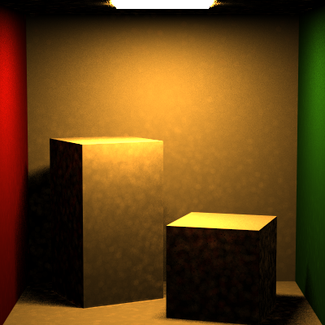

# HW9_PhotonMapping

## Results

100 samples, 5 recursions. 

26240 photons(exclude the first batch came out directly from light.)

It took almost 1.5 hour to render this image. 

## Important Notice: 

Due to UNKNOWN reasons, the GUI has some problems... it remains the old version even if I replaced the original mainwindow.ui

So, to use photon mapping, you should select "Indirect Lighting" since photon mapping does not exist in the menu(although I added it). 

For the performance part, the photon bounce part is very fast, problem lies in the sorting before building kd tree. 

If the total photons to sort is more than 50K, we shall have some problems. I wonder if that's the int's problem, but seems in Qt the sizeof int is 4 byte so there shouldn't be a problem.

Anyway, the sorting runs in sequence of XYZ axis, so if you see "sorting Y" in the command window, it has finished 1/3.

The building part is very fast. Another problem is in searching KD Tree.

I thought my KD tree searching runs fast enough, but since for each pixel we are doing 100 samples, which means searching KD tree for 100 times, it still slows down the program.

## DEBUG Mode:

I left a DEBUG Mode for the photon checking, if you enable the debug in photon shooting, all the photon "color" will goes from red to blue, according to bounce times.

## UPDATE

Since searching the KD tree for each sample in each pixel is not necessery, I modified the functions. In this version, the Li function ONLY compute direct lighting. 

The photon mapping part is now in the "photon gather" function. In Integrator Class, this virtual function just returns Color3f(0) since every other integrators will call this function. But in photon mapping integrator there's another implementation of this function so it does the KD Tree searching and add the photon energy with the direct lighting. 

The timing shorted from 1.5 hour to 5 minutes for a 100 sample 10K photon map.

IF you wish to see the original version of photon mapping, you can move the function from outside the sample loop to inside the sample loop, so it still runs per sample per pixel. 

## Photon 40K

Besides, in the KD Tree part, to support tons of photons, I changed all of "int"s to "long". It do slows down the program, but it supports a larger photon structure. 

These two images are rendered using 40,000 photons: 

